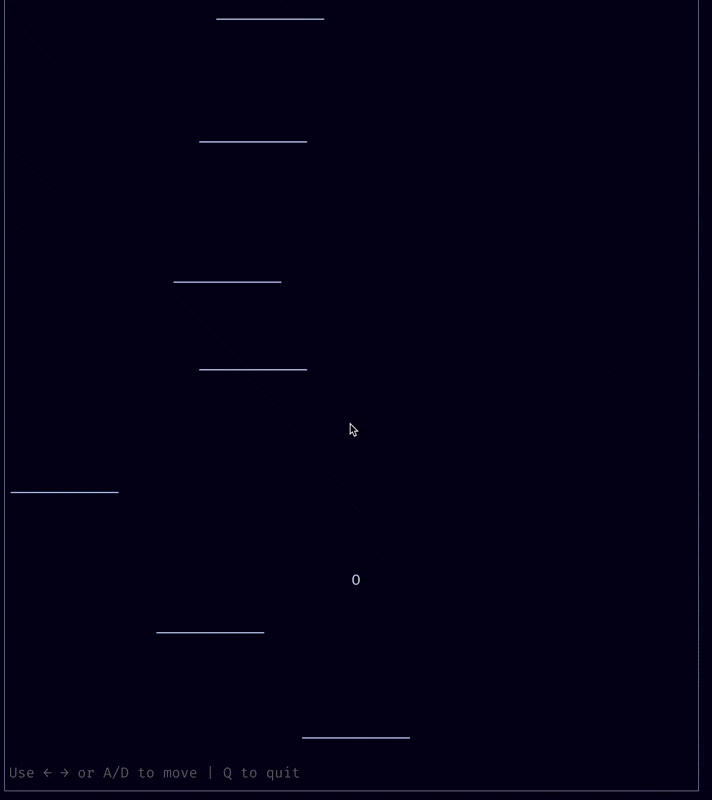

# Bean Jump

A terminal-based DoodleJump clone built with Go, Bubble Tea, and physics simulation.



## Features

- **Physics-based gameplay**: Gravity, jumping, and collision detection
- **Smooth scrolling camera**: Follows the player as they jump higher
- **Infinite platform generation**: Platforms are generated procedurally as you climb
- **Terminal responsive**: Adapts to different terminal sizes
- **Score tracking**: Points based on height achieved

## Controls

- `←` / `A`: Move left
- `→` / `D`: Move right  
- `R`: Restart game (when game over)
- `Q` / `Ctrl+C` / `Esc`: Quit

## Installation

1. Clone or create the project directory
2. Run the game:

```bash
cd bean-jump
go run cmd/main.go
```

## Architecture

The project is structured with separation of concerns:

- `/internal/physics/`: Vector math and collision detection
- `/internal/game/`: Game logic, physics simulation, and state management
- `/internal/tui/`: Terminal user interface using Bubble Tea
- `/cmd/`: Main entry point

## Physics Inspiration

This game uses physics concepts adapted from the game [go-go-go](https://github.com/yanmoyy/go-go-go):

- **Vector-based movement**: Position and velocity calculations
- **Collision detection**: Circle-rectangle collision for player-platform interactions
- **Smooth simulation**: Fixed timestep physics updates at 60 FPS
- **Camera following**: Smooth scrolling viewport that tracks the player

The physics simulation runs independently from the rendering, allowing for smooth gameplay even in terminal environments.
